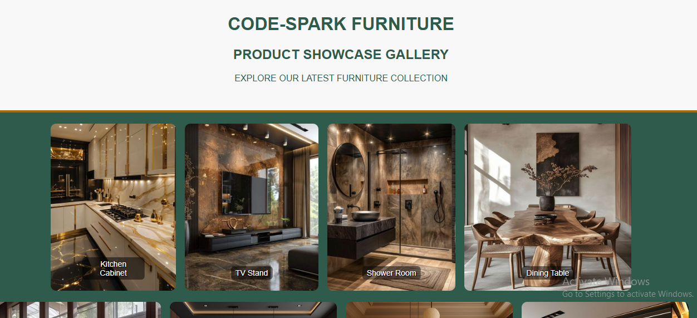

# 🛋️ Product Showcase Gallery

A clean, responsive furniture product gallery built using **HTML5** and **CSS3**. This project displays a variety of home furniture items in a sleek, image-focused layout — with zero JavaScript and no external frameworks.

---

## 🌐 Live Demo  
🔗 [View it on GitHub Pages](https://github.com/kal1kidan/product-showcase-gallery)  

---

## 🖼️ Project Screenshot

  
---

## 🎯 What I Learned

✨ Through this project, I practiced:
- Responsive layouts using **CSS Flexbox**
- The **Box Model**, spacing, and alignment
- Styling image captions with **absolute positioning**
- Proper use of **alt attributes** for accessibility
- Creating a visually appealing UI with only **HTML + CSS**

---

## 🛠️ Technologies Used

- HTML5  
- CSS3  
- Flexbox  
- Responsive Design Principles

---

## 📂 Folder Structure

